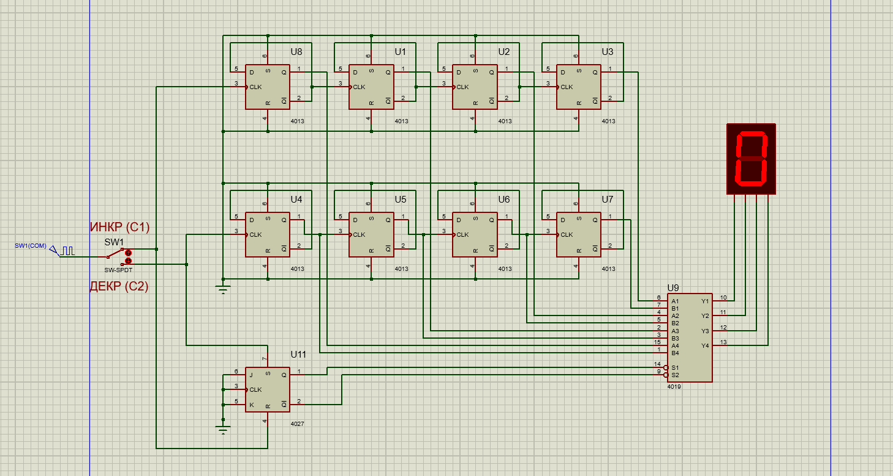
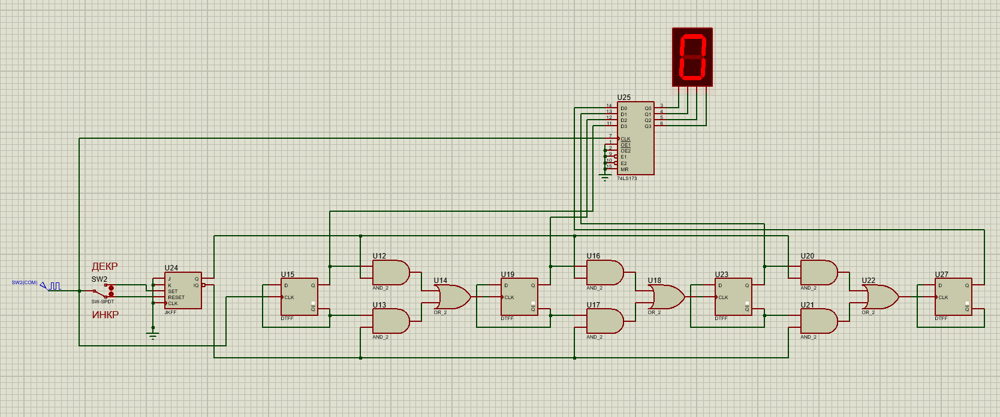

# Отчет
## 4-bit-D-trigger-counter

## Задание
Вариант 12.
Реализовать 4-х разрядный счетчик на D-триггерах с возможностью как прямого счета, так и реверсивного. То есть должно быть 2 тактирующих входа – при подаче тактирующего сигнала на первый вход счетчик инкрементирует свое значение, при подаче тактирующего сигнала на второй вход счетчик декрементирует свое значение. Отобразить работу схемы с семисегментных индикаторов.
#### Общие требования:
1. Наличие принципиальной схемы устройства.
2. Входные данные поступают по входной шине.
3. Входные и выходные значения записываются в регистры.
4. Необходимо учесть задержки микросхем и нелогических элементов.
5. Построение схемы согласно ГОСТ.
6. Если в задании речь об элементах логики, то подразумеваются Инвертор, Буфер, 2 И, 2 ИЛИ, 2 И-НЕ, 2 ИЛИ-НЕ, 2 Исключающее ИЛИ (2 Х – 2 входа, 1 выход).
7. Если в задании не сказано про элементную базу, то пользоваться можно всеми элементами.
8. Необходимо построить временную диаграмму работы в ключевых точках схемы и рассчитать максимальную частоту работы схемы.
9. Все парные задания не требуют наличия принципиальной схемы, расчетов и временных диаграмм – достаточно модели в ПО Proteus.

## Выполнение
Реализовала два варианта счетчика в Proteus. В первом варианте выполняется требование о двух тактирующих входах. Второй вариант - реверсивный 4-х битный счетчик на D-триггерах. Обе схемы работают по фронту. Временные диаграммы и частоты указаны на принципиальных схемах.

#### Первая схема
Схема состоит из двух счетчиков: суммирующего и вычитающего, построеных на D-триггерах. Для этого D-триггеры подключены таким образом, чтобы они функционировали как Т-триггеры, а именно, вход D соединен с выходом -Q. 

##### Описание схемы
В схеме два входа:  
1. Тактирующий вход первого триггера суммирующего счетчика, при подаче на него тактирующего сигнала, весь счетчик будет рабоать в инкрементирующем режиме.
2. Тактируюший вход первого триггера вычитающего счетчика, подача сигнала на который переведет счетчик в декрементирующий режим.

К тактирущим входам последующих триггеров подключены -Q выходы предыдущих в схеме инкрементирущего счетсика, и Q выходы - в схеме декрементирующего. Все Q выходы триггеров, составляющих суммирующий счетчик, подключены к А входам мультиплексора, декрементирующий - к В входам. Причем в обратном порядке, т.е. на первый вход мультиплексора подключен выход последнего триггера.

Чтобы на управляющие входы мультиплексора поступало нужное значение, я подключила к его управляющим входам выходы JK-триггера с RS входами. Как только на его входе SET изменяется значение, на выходе Q устанавливается логическя единица, а когда значение меняется на входе RESET, на прямом выходе устанавливается логический ноль. Я подключила входы J, K, C к общему потенциалу, а входы SET и RESET ко входам схемы С2 и С1 соответственно.

Выходы мультиплексора подключены к семисегментному индикатору со встроенным дешифратором. 

##### Описание работы
При подаче тактирующего сигнала на вход С1, запускаем работу суммирующего счетчика. Значение JK-триггера устанавливается в логический ноль, что переводит мультиплексор в режим вывода на семисегментый индикатор значений суммирующего счетчика.

При подаче тактирующего сигнала на вход С2, переводим счетчик в вычитающий режим. Значение JK-триггера устанавливается в логическую единицу, что переводит мультиплексор в режим вывода на на семисегментый индикатор значений вычитающего счетчика.

#### Вторая схема
Схема состоит из 4-х D-триггеров, между которыми по 3 логических элемента: 2 И и 1 ИЛИ, JK-триггера с RS входами и регистра. 

##### Описание схемы
В схеме один вход, на который надо подать тактирующий сигнал и "кнопка" - ключ, переключающая режимы счета. Входной тактирующий сигнал подключен ко входам CLK первого D-триггера и регистра и ключу. 

Верхнее положение ключа соответствует поключению ко входу SET JK-триггера, что переводит его значение в логическую единицу, нижнее - RESET, переводящее триггер в логический ноль. Прямой выход триггера подключен ко входам трех элементов И, на вторые входы которых подается значения D-триггеров. Инверсный выход JK-триггера подключен ко входам оставшихся трех элементов И, на вторые выходы которых подаются значения с инверсных выходов D-триггеров. Выходы всех элементов И подключены ко входу CLK следующего D-триггера. 

Выходы D-триггеров подключены ко входам регистра в обратном порядке, выходы регистра подключены к семисегментному индикатору со встроенным дешифратором. 

##### Описание работы
При подаче тактирующего сигнала на вход:

Переключение ключа в верхнее положение установит JK-триггер в значение логической единицы. На CLK входы последующих D-триггеров будут поступать прямые значения предыдущих D-триггеров, т.к. на эти входы поступает результат логического сложения выхода двух конъюнкторов: первый логически умножает значения прямых выходов JK- и D-триггеров, вторрой - инверсные. И схема будет работать как вычитающий счетчик.

Переключение ключа в нижне положение установит JK-триггер в значение логического ноля. На CLK входы последующих D-триггеров будут поступать инверсные значения предыдущих D-триггеров, и схема будет работать как суммирующий счетчик.
